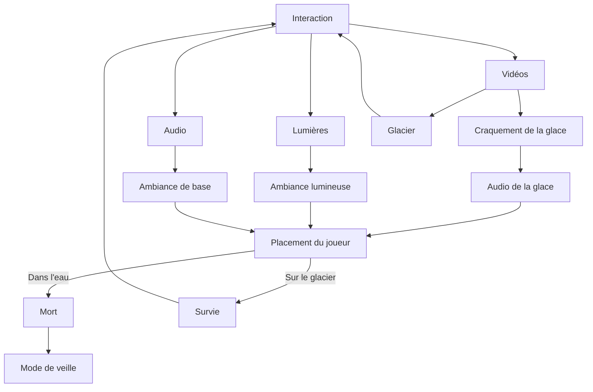

# Glacial par Audrey Dandurand
## Concept
Glacial est une installation interactive formée de projections vidéos sur les murs et sur le plancher. Celle-ci représente l'environnement glacial de l'Antartique et elles sont formées d'animations 3D.

Un glacier est présenté sur le sol par une projection et une ambiance sonore est jouée dans la salle. Le visiteur est amené à se déplacer dans l'espace et à survivre face à la fonte des glaces. Tout d'abord, il sera amené à se placer sur le glacier. Après un certain moment, la glace craquera et le visiteur devra se déplacer pour survivre. Les déclenchements de la fonte de glace seront effectués par la position des visiteurs dans l'espace et ceux-ci seront accompagnés de plusieurs sons. Tant que le visiteur ne sera pas dans un espace ciblé, il restera en vie sur le glacier. S'il sort du glacier, ce sera la fin pour lui. 

Dès que les visiteurs sont tous morts, la projection du sol devient de plus en plus foncée comme si l'animal coulait au fond de l'eau. Les lumières deviennent elles aussi bleu foncé. Un message apparait sur les murs pour sensibiliser le public face au réchauffement climatique.

Il n'y a aucun moyen de gagner le jeu.

La salle a une ambiance bleutée durant l'expérience.

|   |     |
| -------- | ------- |

## Objectif
L'objectif est de sensibiliser le public face aux enjeux du réchauffement climatique et de la perte de faune.

## Motivations 
La technologie permet de faire réfléchir le public. Ce sujet est important, puisque notre futur en sera impacté.

## Scénario interactif

## Planche d'ambiances visuelles

## Planche d'ambiances sonores
<iframe width="560" height="315" src="https://www.youtube.com/embed/xdWXvurWb2U?si=Y4n-GHaK9mWUAcEd" title="YouTube video player" frameborder="0" allow="accelerometer; autoplay; clipboard-write; encrypted-media; gyroscope; picture-in-picture; web-share" referrerpolicy="strict-origin-when-cross-origin" allowfullscreen></iframe>

<iframe width="560" height="315" src="https://www.youtube.com/embed/ltkhJhNo6a8?si=_nwkhdPDrkjOinOO" title="YouTube video player" frameborder="0" allow="accelerometer; autoplay; clipboard-write; encrypted-media; gyroscope; picture-in-picture; web-share" referrerpolicy="strict-origin-when-cross-origin" allowfullscreen></iframe>

## Références artistiques
#### L'esthétique et le design
Une palette de couleur bleutée a été choisie pour soutenir le thème de la fonte des glaciers. Celle-ci va s'appliquer autant à la lumière que les animations 3D.

Les images visuelles auront un aspect plus réaliste pour sensibiliser davantage le public cible.

#### Choix de références visuelles
Les expériences interactives présentées démontrent la projection à 360 degrés ainsi que la projection sur le sol. Dans les images d'exposition interactive, nous pouvons apercevoir sur le sol une vue du dessus et sur le mur, une vision de face. Ce principe est ce qui est voulu pour l'oeuvre Glacial.

#### Choix de références sonores
Les ambiances permettent de bien représenter le milieu dans lequel sont plongés le public.

## Support médiatique
Divers médias sont utilisés pour cette installation.

| Type de médias    | Intégration |
| -------- | ------- |
| Projections d'animation 3D  | Elles sont présentes sur tous les murs et le plafond du début à la fin de l'expérience.    |
| Audio | Une ambiance de base joue durant l'expérience et plusieurs sons y sont ajoutés.     |
| Lumières DMX    | Ces lumières apportent une ambiance bleautée à l'expérience.    |
| Capteur de mouvement    |  Celui-ci permet l'interactivité de Glacial.    |

## Matériel
- 1 Kinect
- 6 Lumières American DJ 5p Hex
- 5 Projecteurs
- 4 Haut-parleurs

## Logiciel

| Logiciel    | Technique |
| -------- | ------- |
| Touch designer  | Rassemble le son et la 3d pour effectuer la projection    |
| Reaper | Montage sonore     |
| Maya    | Animation 3D    |
| QLC+    | Création des scènes lumineuses    |
| Plugdata    | Création d'un lfo pour modifier les couleurs des lumières    |

| Système de communication  | Logiciel    | Interaction |
| -------- | ------- |------- |
| Protocole MIDI  |  LoopMidi  | QLC+ et Plugdata  |
| Protocole DMX  |  QLC+  | Lumiere et logiciel  |
